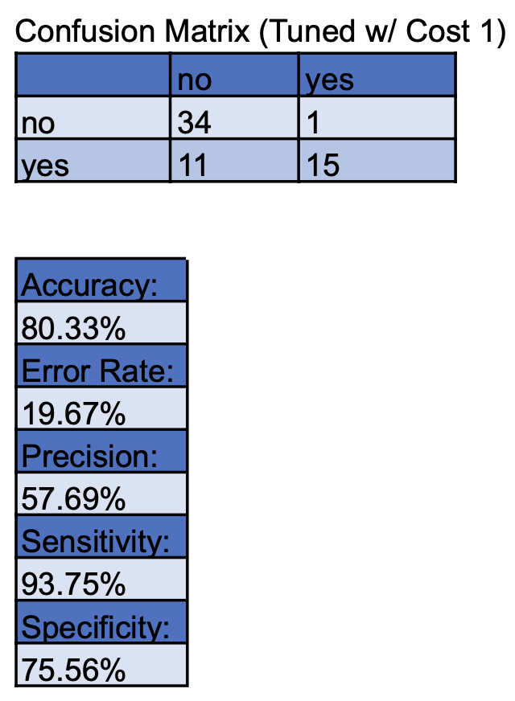
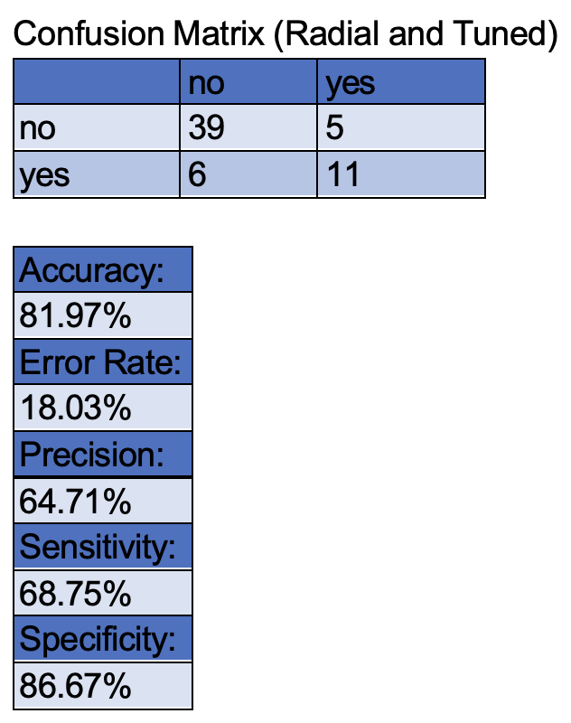

# CardioScope: A Data-Driven Approach to Cardiac Health

## Project Overview

This project analyzes a heart disease dataset to predict exercise-induced angina, a common symptom of Congenital Heart Disease (CHD). We explore various machine learning models to determine the most effective approach for early detection of this condition.

## Background

Heart disease is one of the leading causes of death globally, causing over 12 million deaths each year. Early diagnosis of heart disease is critical for preventing complications and saving lives. Using patient data and machine learning, this project aims to predict the occurrence of exercise-induced angina, which is a symptom of coronary heart disease (CHD).

### Dataset Information

We used the Heart Disease dataset from the UCI Machine Learning Repository. The dataset contains patient records from four sources:

1. Cleveland Clinic Foundation
2. Hungarian Institute of Cardiology
3. V.A. Medical Center (Long Beach, CA)
4. University Hospital (Zurich, Switzerland)

While the dataset originally contains 76 attributes, we focused on 14 key features, including:

- Chest pain (cp)
- Resting blood pressure (trestbps)
- Cholesterol (chol)
- Fasting blood sugar (fbs)
- Maximum heart rate achieved (thalach)
- ST depression induced by exercise (oldpeak)

The dataset includes 303 observations, and we primarily worked with the Cleveland dataset for prediction.

## Objective

Our goal was to predict whether a patient would experience exercise-induced angina (exang) based on non-fatal attributes like cholesterol and resting blood pressure. This could help in early detection of CHD, allowing timely interventions.

## Methods & Models

We explored two machine learning models:

- **K-Nearest Neighbors (KNN)**
- **Support Vector Machine (SVM)**

### Data Preprocessing

- **Normalization**: We normalized the data to ensure all features were on a similar scale.
- **Feature Selection**: Binary features were removed since they do not perform well with normalization.
  
### Model Performance

| Model          | Accuracy | Error Rate | Precision | Sensitivity | Specificity |
|----------------|----------|------------|-----------|-------------|-------------|
| **KNN**        | 86.44%   | 13.56%     | 72.22%    | 81.25%      | 88.37%      |
| **SVM (Linear)**| 80.33%   | 19.67%     | 57.69%    | 93.75%      | 75.56%      |
| **SVM (Radial)**| 81.97%   | 18.03%     | 64.71%    | 68.75%      | 86.67%      |

Based on the comparison, KNN performed the best overall, with the highest accuracy and precision.

### Confusion Matrices

#### KNN (K=10)

#### SVM (Linear Kernel)

#### SVM (Radial Kernel)

## Results

The KNN model achieved the highest accuracy (86.44%), precision (72.22%), and specificity (88.37%), making it the most suitable model for predicting exercise-induced angina. However, the linear SVM model performed best in sensitivity (93.75%), meaning it was more effective at predicting true positives.

## Limitations

One of the major limitations observed was precision. False positives affected precision, as seen in the ROC curve. Increasing true positives often led to more false positives, thus lowering precision.

## Conclusion

KNN is the most optimal model for predicting exercise-induced angina due to its balance of accuracy, precision, and specificity. Early detection of exercise-induced angina could help in timely intervention for patients at risk of developing coronary heart disease.

## References

- [Heart Disease Dataset - UCI Machine Learning Repository](https://archive.ics.uci.edu/ml/datasets/heart+disease)
- [KNN Tutorial](https://quantdev.ssri.psu.edu/sites/qdev/files/kNN_tutorial.html)
- [SVM Explanation](https://bradleyboehmke.github.io/HOML/svm.html)
